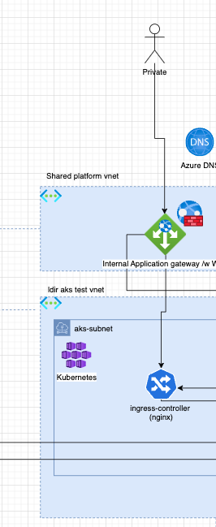
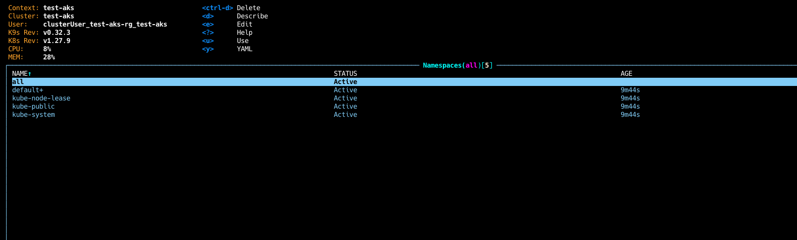

# Introduction 
This repository is a test repository for testing of creating a typical aks environment in Azure. 
Guide here is meant to create a: 
* Virtual network with 2 subnets 
* Network security groups for the the subnets 
* A Azure DNS zone 
* A Application Gateway with 
* A AKS Cluster 

 
# Architecture 



# Guide

## Preqrequisites 
Azure Subscription with a contributor role ot the subscription 

Login and select your subscription: 

```
az login 

az account set --subscription "<subscriptionName>"

```

Install kubectl on your local development station: 
https://kubernetes.io/docs/tasks/tools/

Install k9s on your local development station: 
https://k9scli.io/topics/install/ 


### Network 
Create a Resource Group and a network with two subnets 


```
az group create \
    --name test-rg \
    --location westeurope


az network vnet create \
    --name test-vnet \
    --resource-group test-rg \
    --address-prefix 10.12.0.0/20 \

az network nsg create \
    --name test-appgw-nsg \
    --resource-group test-rg

az network nsg rule create \
    --name AllowInboundAgw \
    --nsg-name test-appgw-nsg \
    --priority 1000 \
    --resource-group test-rg \
    --source-address-prefixes 'Internet' \
    --source-port-ranges '*' \
    --destination-address-prefix '*' \
    --destination-port-ranges '65200-65535' \
    --access Allow \
    --protocol Tcp

az network nsg create \
    --name test-aks-nsg \
    --resource-group test-rg    

az network vnet subnet create \
    --name test-appgw \
    --resource-group test-rg \
    --vnet-name test-vnet \
    --address-prefix 10.12.1.0/24 \
    --network-security-group test-appgw-nsg

az network vnet subnet create \
    --name test-aks \
    --resource-group test-rg \
    --vnet-name test-vnet \
    --address-prefix 10.12.2.0/24 \
    --network-security-group test-aks-nsg

```
* Copy the SubnetID for further use on aks
### AKS 

```
az group create \
    --name test-aks-rg \
    --location westeurope

az aks create \
    --resource-group test-aks-rg \
    --name test-aks \
    --enable-managed-identity \
    --node-count 1 \
    --generate-ssh-keys \
    --network-plugin azure \
    --network-plugin-mode overlay \
    --vnet-subnet-id '<SubscriptionID>'

```
Adding a node pool to our cluster: 

```
az aks nodepool add \
    --name userpool \
    --cluster-name test-aks \
    --resource-group test-aks-rg \
    --mode User \
    --node-count 2

```

Now that the AKS is created, get your credentials by running 

```
az aks get-credentials --name test-aks --resource-group test-aks-rg

```

Now you can check that your cluster is running by for example running k9s 

```
k9s
```



Or for example checking running pods through kubectl 

```
kubectl get pods --all-namespaces
```


Now that we have a running cluster, lets create bootstrap argoCD into this cluster to get GitOps up and running. 

```
kubectl create namespace argocd
kubectl apply -n argocd -f https://raw.githubusercontent.com/argoproj/argo-cd/stable/manifests/install.yaml
```

Now lets find our newly created argoCD service: 

```
kubectl get svc -n argocd
```

And lets use port forwarding to make it available on our local workstation

```
kubectl port-forward -n argocd svc/argocd-server 8080:443
```

Copy the URL from your terminal, and go to your browser and access argoCD (skip https error).

To log into the argocd we need a username and password. 
The username is admin, to find password we can utilize k9s. 

Run k9s
```
k9s
```
Find the secrets for argo by going 
```
:namespaces 
:secrets 
```
Here you will get a list of secrets, look for "argocd-initial-admin-secret"
```
x - decode 
```

Copy the password for the admin user and paste it into the UI you opened previously. 
x

Before we can utilize the applciation.yaml under the /argoCD/ folder in the repos. We need to enable 
helm charts in argoCD (ease of use for demo)
Run 

```
kubectl apply -f /argoCD/configmap.yaml
```

Then we can install our applications. 
So we'll start with creating our ingress controller. 
We have 


### Application Gateway


Creating an Application Gateway (we will configure through portal later on)

```
az group create \
    --name test-agw-rg \
    --location westeurope

az network public-ip create \
 --resource-group test-agw-rg \
 --name test-agw-pip \
 --allocation-method Static \
 --sku Standard

az network application-gateway create \
    --name test-agw \
    --location westeurope \
    --resource-group test-agw-rg \
    --vnet-name test-vnet \
    --subnet test-appgw \
    --capacity 1 \
    --sku Standard_v2
    --http-settings-cookie-based-affinity Disabled \
    --frontend-port 80 \
    --http-settings-port 80 \
    --http-settings-protocol Http \
    --public-ip-address test-agw-pip \
    --priority 101 \
    --routing-rule-type Basic
